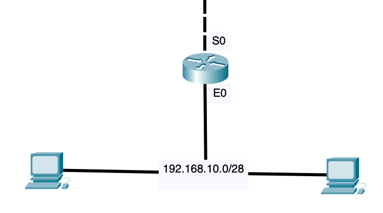

# Easy subnetting - review questions

1. What is the maximum number of IP addresses that can be assigned to hosts on a local subnet that uses the 255.255.255.224 subnet mask?  
    **A.** 14  
    **B.** 15  
    **C.** 16  
    **D. 30 (My answer)**   
    **E.** 31  
    **F.** 62  

    .224 = 111**00000**  
    25 - 2 = 30

2. You have a network that needs 29 subnets while maximizing the number of host addresses available on each subnet. How many bits must you borrow from the host field to provide the correct subnet mask?  
    **A.** 2  
    **B.** 3  
    **C.** 4  
    **D. 5 (My answer)**   
    **E.** 6  
    **F.** 7  

    25 = 32 subnets
    23 - 2 = 6 hosts   
    255.255.255.248
    
3. What is the subnetwork address for a host with the IP address 200.10.5.68/28?  
    **A.** 200.10.5.56  
    **B.** 200.10.5.32  
    **C. 200.10.5.64 (my answer)**  
    **D.** 200.10.5.0  

    Subnet mask: 255.255.255.248  
    Block size: 256 - 248 = 8  
    Subnets: .0, .8, .16, .24, .32, .40, .48, .56, .64, .72, ...  
    Subnetwork address: 200.10.5.64  

4. The network address of 172.16.0.0/19 provides how many subnets and hosts?
    **A.** 7 subnets, 30 hosts each  
    **B.** 7 subnets, 2,046 hosts each  
    **C.** 7 subnets, 8190 hosts each  
    **D.** 8 subnets, 30 hosts each  
    **E.** 8 subnets, 2046 hosts each  
    **F. 8 subnets, 8190 hosts each (My answer)**  
    
    Subnet mask: 255.255.224.0 
    Block size: 256 - 224 = 32  
    Subnets: 0.0, 32.0, 64.0, .96.0, .128.0, .160.0, .192.0, .224.0  
    214 - 2 = 8190 hosts in each subnet

5. Which two statements describe the IP address 10.16.3.65/23? (Choose two.)  
**A.** The subnet address is 10.16.3.0 255.255.255.254.0.  
**B. The lowest host address in the subnet is 10.16.2.1 255.255.254.0. (My answer)**  
**C.** The last valid host address in the subnet is 10.16.2.254 255.255.254.0.  
**D. The broadcast address of the subnet is 10.16.3.255 255.255.254.0. (My answer)**  
**E.** The network is not subnetted.  

    Class A reserved IP address  
    15 subnet bits  
    9 host bits  

    Block size: 256 - 254 = 2  
    Subnets: 215 = 32769  
    0.0, 2.0, 4.0, 6.0, 8.0, 10.0, ...  

6. If a host on a network has the address 172.16.45.14/30, what is the subnetwork this host belongs to?  
**A.** 172.16.45.0  
**B.** 172.16.45.4  
**C.** 172.16.45.8  
**D. 172.16.45.12 (My answer)**  
**E.** 172.16.45.16

    Class B reserved IP address  
    Subnet mask: 255.255.255.252  
    Block size: 256 - 252 = 4  
    45,0, 45.4, 45.8, 45.12, 45.16, 45.20, ...  

7. Which mask should you use on point-to-point WAN links on order to reduce the waste of IP addresses?  
A. /27  
B. /28  
C. /29  
**D. /30 (My answer)**  
E. /31  

8. What is the subnetwork number of a host with an IP address of 172.16.66.0/21?  
**A.** 172.16.36.0  
**B.** 172.16.48.0  
**C. 172.16.64.0 (My answer)**   
**D.** 172.16.0.0  

    Class B reserved IP address  
    13 subnet bits  
    11 host bits  

    Subnet mask: 255.255.248.0  
    Block size: 256 - 248 = 8  
    Subnets: 0.0, 8.0, 16.0, 32.0, 48.0, 64.0, 80.0, ...  
    Subnetwork: 172.16.64.0  

9. You have an interface on a router with an IP address of 192.168.192.10/29. Including the router interface, how many hosts can have IP addresses on the LAN attached to the router interface?  
**A. 6 (My answer)**  
**B.** 8  
**C.** 30  
**D.** 62  
**E.** 126  

    Hosts: 23 - 2 = 6  

10. You need to configure a server that is on the subnet 192.168.19.24/29. The router has the first available host address. Which of the following should you assign to the server?  
**A.** 192.168.19.0 255.255.255.0  
**B.** 192.168.19.33 255.255.255.240  
**C. 192.168.19.26 255.255.255.248 (My answer)**  
**D.** 192.168.19.31 255.255.255.248  
**E.** 192.168.19.34 255.255.255.240  

    Subnet mask: 255.255.255.248  
    Block size: 256 - 248 = 8  
    0, 8, 16, 24, 32, ...  

11. You have an interface on a router with the IP address of 192.168.192.10/29. What is the broadcast address the hosts will use on this LAN?  
**A. 192.168.192.15 (My answer)**  
**B.** 192.168.192.31  
**C.** 192.168.192.63  
**D.** 192.168.192.127  
**E.** 192.168.192.255

    Subnet mask: 255.255.255.248  
    Block size: 256 - 248 = 8  
    Subnets: .0, .8, .16, .24, ...  
    Subnetwork address: 192.168.192.8  
    Broadcast address: 192.168.192.15

12. You need to subnet a network that has 5 subnets, each with at least 16 hosts. Which classful subnet mask would you use?  
**A.** 255.255.255.192  
**B. 255.255.255.224 (My answer)**   
**C.** 255.255.255.240  
**D.** 255.255.255.248  

    /27  
    25 - 2 = 30  

13. You configure a router interface with the IP address 192.168.10.62 255.255.255.192 and receive the following error:  

    `Bad mask /26 for address 192.168.10.62`  

    Why did you receive this error?
    **A.** You typed this mask on a WAN link and that is not allowed.  
    **B.** This is not a valid host and subnet mask combination.  
    **C. `ip subnet-zero` is not enabled on the router. (My anwser)**  
    **D.** The router does not support IP.  

    /26
    Hosts: 26 - 2 = 62  
    Subnets: 22 = 4  
    Block size: 256 - 192 = 64  
    Subnets: .0, .64, .128, .192  

14. If an Ethernet port on a router were assigned an IP address of 172.16.112.1/25, what would be the valid subnet address of this interface?  
**A. 172.16.112.0 (My answer)**  
**B.** 172.16.0.0  
**C.** 172.16.96.0  
**D.** 172.16.255.0  
**E.** 172.16.128.0  

    /25  
    Subnet mask: 255.255.255.128  
    Block size: 256 - 128 = 128  
    Subnets: .0, .128
    Subnetwork: 172.16.112.0  

15. Using the following illustration, what would be the IP address of E0 if you were using the eighth subnet? The network ID is 192.168.10.0/28 and you need to use the last available IP address in the range. The zero subnet should not be considered valid for this question.  

    
**A. 192.168.10.142 (My answer)**  
**B.** 192.168.10.66  
**C.** 192.168.100.254  
**D.** 192.168.10.143  
**E.** 192.168.10.126  

/28  
Subnet mask: 255.255.255.240  
Block size: 256 - 240 = 16  

|#|1|2|3|4|5|6|7|8|9|10|
|-|-|-|-|-|-|-|-|-|-|-|
|**Subnet**|.16|.32|.48|.64|.80|.96|.112|**.128**|.144|.160|

Subnetwork: 192.168.10.128  
First host: 192.168.10.129  
**Last host: 192.168.10.142**  
Broadcast: 192.168.10.143

16. Using the illustration from the previous question, what would be the IP address of S0 if you were using the first subnet? The network ID is 192.168.10.0/28 and you need to use the last available IP address in the range. Again, the zero subnet should not be considered valid for this question.  
**A.** 192.169.10.24  
**B.** 192.168.10.62  
**C. 192.168.10.30 (My answer)**  
**D.** 192.168.10.127  
