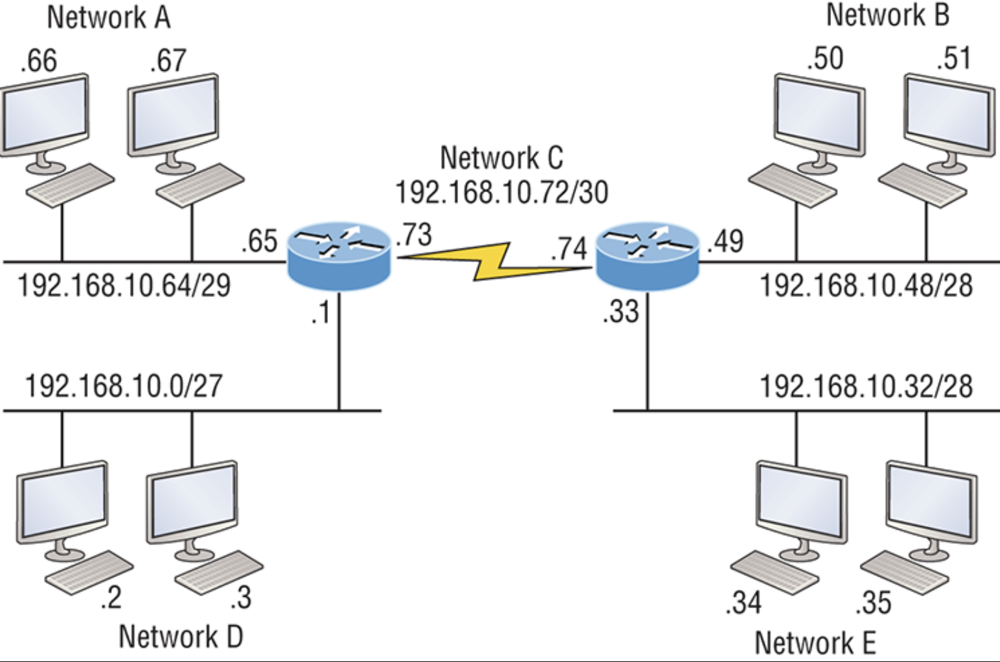
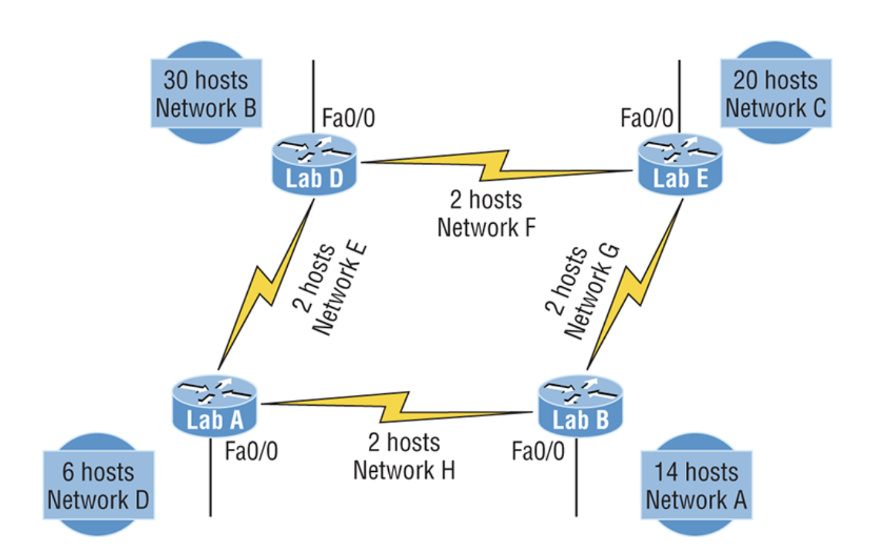
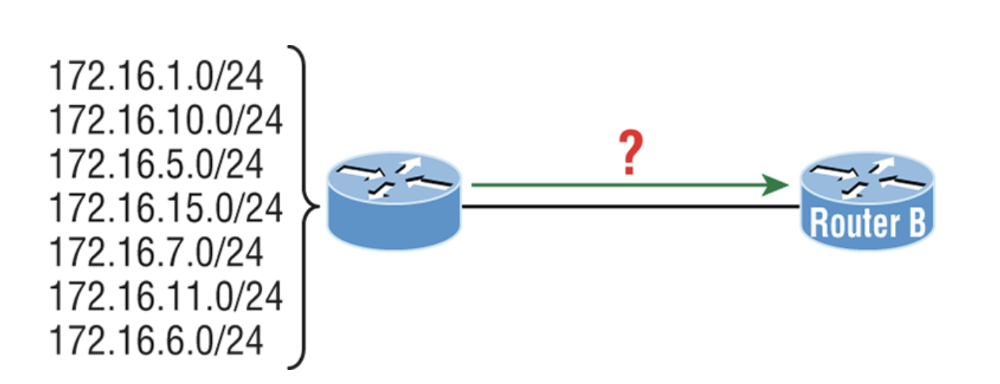
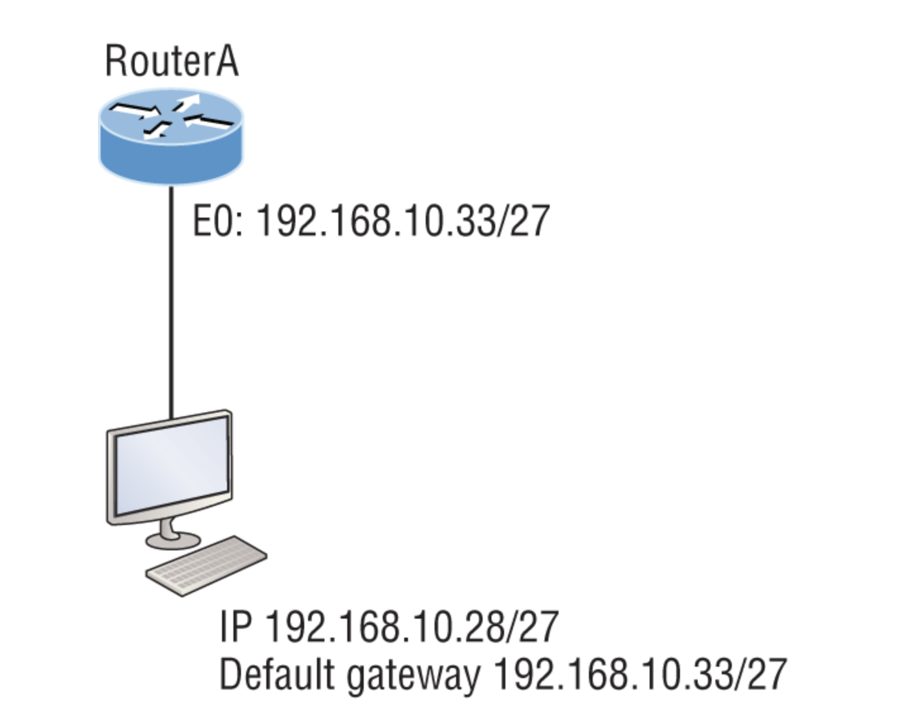

# VLSM Summarization and troubleshooting TCP/IP review questions

1. On a VLSM network, which mask should you use on point-to-point WAN links in order to reduce the wate of IP addresses?  

    **A.** /27  
    **B.** /28  
    **C.** /29  
    **D. /30 (My answer)**   
    **E.** /31  

    In a point-to-point WAN link 1 IP address is needed for each of the two routers, so 2 IPs in total.  

    A /30 mask provides 2 host IP addresses, i.e. 22-2 = 2    

---

2. In the network shown in the diagram, how many computers could be in subnet B?

    

    **A.** 6  
    **B.** 12  
    **C. 14 (My answer)**  
    **D.** 30  

    24 - 2 = 14

---

3. In the diagram below, in order to have as efficient IP addressing as possible, which network should use a /29 mask?  

    

    **A.** A  
    **B.** B  
    **C.** C  
    **D. D (My answer)**  

    23 - 2 = 6 hosts

---

4. To use VLSM, what capability must the routing protocols in use possess?  

    **A.**	Support for multicast  
    **B.**	Multiprotocol support  
    **C.	Transmission of subnet mask information (My answer)**  
    **D.**	Support for unequal load balancing  

---

5. What summary address would cover all the networks shown and advertise a single, efficient route to Router B that won't advertise more netowrks than needed?  

    

    **A.**	172.16.0.0/24  
	**B.**	172.16.1.0/24  
	**C.** 	172.16.0.0/24  
	**D.	172.16.0.0/20 (My answer)**  
	**E.**	172.16.16.0/28  
	**F.**	172.16.0.0/27  

6. In the diagram below what is the most likely reason the station cannot ping outside of its network?  

     

    **A.**	The IP address is incorrect on E0 of the router.  
	**B.**	The default gateway address is incorrect on the station.  
	**C. 	The IP address on the station is incorrect. (My answer)**  
	**D.**	The router is malfunctioning.  

7.	If Host A is configured with an incorrect default gateway and all other computers and the router are known to be configured correctly, which of the following statements is TRUE?  

	A.	Host A cannot communicate with the router. 
	B.	Host A can communicate with other hosts in the same subnet.
	C. 	Host A can communicate with hosts in other subnets.
	D.	Host A can communicate with no other systems.